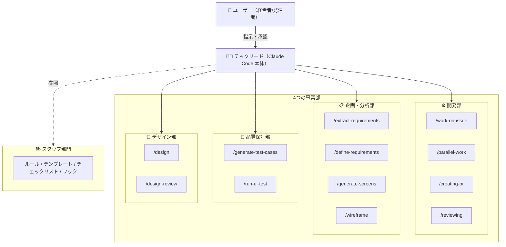
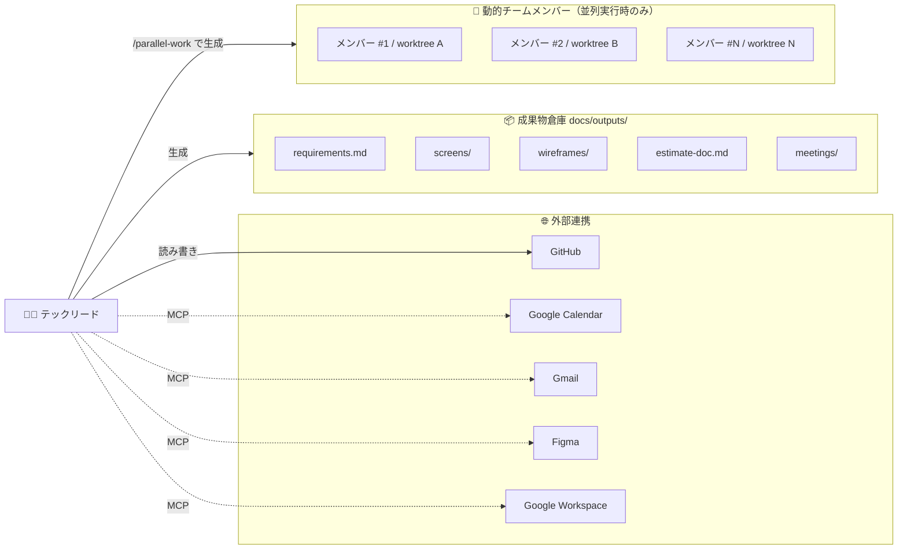

# ai-concierge

## What's this?

チーム全員が AI（Claude Code）を使って業務を自動化するための実験プロジェクトです。

- エンジニアが AI と協働することで、要件定義・見積もり・画面設計などの上流工程まで一気通貫で担えるようになります
- チャットで指示するだけで、仕様書・見積書・議事録・画面遷移図などを自動生成できます

> **注意**: これはテスト用リポジトリです。ここで検証した内容をベースに、会社のリポジトリへ展開していきます。

## できること一覧

<!-- 新しいコマンドを追加したら、ここに必ず追記してください -->

| やりたいこと | コマンド | 説明 |
|---|---|---|
| 要件定義書を作りたい | `/define-requirements` | 案件の概要情報から機能要件を構造化し、要件定義書を生成します |
| MTG・ヒアリング内容を整理したい | `/extract-requirements` | ミーティングやヒアリングのデータを読み込み、構造化抽出します |
| 画面一覧・遷移図を作りたい | `/generate-screens` | 要件定義の出力から画面一覧・画面遷移図・レイアウトを自動生成します |
| ワイヤーフレームを作りたい | `/wireframe` | 要件定義書から FigJam にワイヤーフレーム図を自動生成します |
| 見積もりを作りたい | `/estimating` | スプシの機能要件から工数を自動算出し、結果をスプシに書き戻します |
| 見積書を作りたい | `/create-estimate-doc` | 工数データと案件情報をもとに見積書を自動生成します |
| 議事録からイシューを起票したい | `/create-issues-from-meeting` | 議事録やレポートのアクションアイテムを GitHub Issues に一括起票します |
| 仕様書から実装計画を作りたい | `/generating-spec` | 仕様書を読み込んで技術設計・タスクリスト・リスク一覧を生成します |
| タスクを自動実行したい | `/executing-plan` | タスクリストを順番に実行し、完了レポートを生成します |
| イシューを実装〜PR作成したい | `/work-on-issue` | イシュー番号を受け取り、分析→実装→PR作成を一気通貫で実行します |
| 複数イシューを並列で進めたい | `/parallel-work` | 複数イシューを依存関係チェック後に並列実行します |
| 変更をPRにしたい | `/creating-pr` | main の変更からブランチ作成・コミット・プッシュ・PR作成を一括実行します |
| 仕様書や成果物をチェックしたい | `/reviewing` | チェックリストに基づいてレビューし、問題点や改善案を提示します |
| このイシュー着手できる？ | `/checking-ready` | 依存イシューの完了状況から着手可否を判定します |
| 今日の予定を確認したい | `/briefing` | Google Calendar から今日の予定を取得し、関連情報があれば添えて報告します |

> コマンドは今後どんどん追加されます。「こんなことも自動化できない？」と思ったら、Claude に聞いてみてください。

## はじめかた

ターミナル（Mac の場合は「ターミナル.app」）を開いて、以下をコピペして実行してください。

```bash
bash scripts/setup.sh
```

これだけで必要なツールのインストールと設定ファイルの作成が完了します。
画面の指示に従って、管理者から共有された認証情報を貼り付けてください。

セットアップが終わったら Claude Code を起動して、「できること一覧」からコマンドを試してみてください。

> 💡 セットアップスクリプトの詳細 → [`scripts/setup.sh`](scripts/setup.sh)

## 外部サービスの設定

Claude Code が Google Workspace 等の外部サービスと連携するために、認証情報の設定が必要です。

### Google Workspace MCP（Gmail / Drive / Docs / Sheets / Calendar 等）

[google_workspace_mcp](https://github.com/taylorwilsdon/google_workspace_mcp) を使って Google Workspace と連携します。

> **💡 チームメンバー向け**: `bash scripts/setup.sh` を実行すれば、ツールのインストールから `.env` の設定まで自動で行えます。以下の手順は管理者向けの参考情報です。

#### 管理者向け: Google Cloud Console の設定（初回のみ）

<details>
<summary>クリックして展開（管理者向け）</summary>

**1. Google Cloud Console でプロジェクトを作成**

1. [Google Cloud Console](https://console.cloud.google.com) にアクセス
2. 新しいプロジェクトを作成（または既存のものを選択）

**2. 必要な API を有効化**

「APIとサービス」→「有効なAPIとサービス」で以下を有効化：

- Google Drive API
- Google Docs API
- Google Sheets API
- Gmail API
- Google Calendar API

**3. OAuth 同意画面を設定**

1. 「APIとサービス」→「OAuth 同意画面」を開く
2. ユーザーの種類: **内部** を選択（Google Workspace アカウント同士で使う場合）
3. スコープの設定はデフォルトのままで OK（MCP 側が必要なスコープを自動リクエストします）

**4. OAuth クライアント ID を作成**

1. 「APIとサービス」→「認証情報」→「認証情報を作成」→「OAuth クライアント ID」
2. アプリケーションの種類: **ウェブアプリケーション**
3. 名前は何でも OK（例: `Claude Code 連携`）
4. 「承認済みのリダイレクト URI」に以下を追加：
   ```
   http://localhost:8000/oauth2callback
   ```
5. 作成後に表示される **Client ID** と **Client Secret** をチームに共有

</details>

#### `.env` の設定と初回認証

`bash scripts/setup.sh` を実行すると、対話形式で `.env` の設定が完了します。

初回のみ、Claude Code で Google 連携コマンド（例: `/briefing`）を実行すると認証用 URL が表示されます。クリックして Google ログインすれば、以降は自動で連携されます。

> ⚠️ 「このサイトにアクセスできません」と表示されても**認証は成功しています**。Claude Code に戻って同じコマンドをもう一度実行してください。

#### よくあるトラブル

| 症状 | 原因と対処 |
|------|-----------|
| `uvx: command not found` | `uv` が未インストール。`bash scripts/setup.sh` を再実行 |
| 認証 URL が表示されない | `.env` の `GOOGLE_OAUTH_CLIENT_ID` / `SECRET` が空 or 間違い |
| 「redirect_uri_mismatch」エラー | Google Cloud Console のリダイレクト URI に `http://localhost:8000/oauth2callback` が設定されていない（管理者に連絡） |
| 「access_denied」エラー | OAuth 同意画面のユーザーの種類が「外部」になっている or テストユーザーに追加されていない（管理者に連絡） |
| 認証したのにまだエラー | 同じコマンドを **もう一度実行** してください（認証後にリトライが必要） |

### Anthropic API（GitHub Actions 用）

PR やイシューに `@claude` とコメントすると Claude が自動で対応する機能に必要です。

1. [Anthropic Console](https://console.anthropic.com/) にアクセスしてログイン
2. **Settings → API Keys → Create Key** で新しいキーを生成
3. GitHub リポジトリの **Settings → Secrets and variables → Actions → New repository secret** に登録：
   - Name: `ANTHROPIC_API_KEY`
   - Secret: 生成したキー

> ⚠️ これは `.env` ではなく **GitHub の Repository Secrets** に登録します（GitHub Actions から使うため）。

### GitHub

PR 作成やイシュー管理に使用します。

1. GitHub → Settings → Developer settings → Personal access tokens → Tokens (classic)
2. 「Generate new token」→ `repo` スコープにチェック → Generate
3. `.env` に設定：
   ```
   GITHUB_PERSONAL_ACCESS_TOKEN=生成したトークン
   ```

### Figma

デザインデータの読み取りに使用します。

1. Figma → 左上のアイコン → Settings → Security → Personal access tokens
2. 「Generate new token」でトークンを生成
3. `.env` に設定：
   ```
   FIGMA_API_KEY=生成したトークン
   ```

## コマンドの使い方

Claude Code のチャット欄に `/{コマンド名}` と入力するだけです。

```
例：見積もりを作りたい場合
/estimate https://docs.google.com/spreadsheets/d/xxxxx/edit
```

## 組織図 — AI コンシェルジュの全体像

このリポジトリの AI エージェントは「会社組織」のメタファーで設計されています。

| 比喩 | 実体 |
|---|---|
| 👤 経営者/発注者 | ユーザー（あなた） |
| 🧑‍💻 テックリード | Claude Code 本体 |
| ⚙️ 開発部 | コーディング系コマンド（`/work-on-issue`, `/parallel-work` 等） |
| 📋 企画・分析部 | 要件定義・分析系コマンド（`/define-requirements`, `/extract-requirements` 等） |
| 🎨 デザイン部 | デザイン系コマンド（Figma 連携） |
| 📚 スタッフ部門 | ルール・テンプレート・チェックリスト |
| 👷 動的チームメンバー | `/parallel-work` 実行時に生成されるサブエージェント |

### 組織構造



### 外部連携と成果物



## フォルダ構成の概要

| フォルダ            | 何が入ってる？                                    |
| ------------------- | ------------------------------------------------- |
| `.claude/commands/` | 自動化コマンドの定義                              |
| `knowledge/`        | AI に教える判断基準・ビジネスルール・テンプレート |
| `docs/ideas.md`     | アイデアの投入口                                  |
| `docs/specs/`       | 精査済み仕様書（自動生成）                        |
| `docs/outputs/`     | 実行結果・生成ファイル（自動生成）                |

詳しいルールは [CLAUDE.md](CLAUDE.md) に書かれています。
