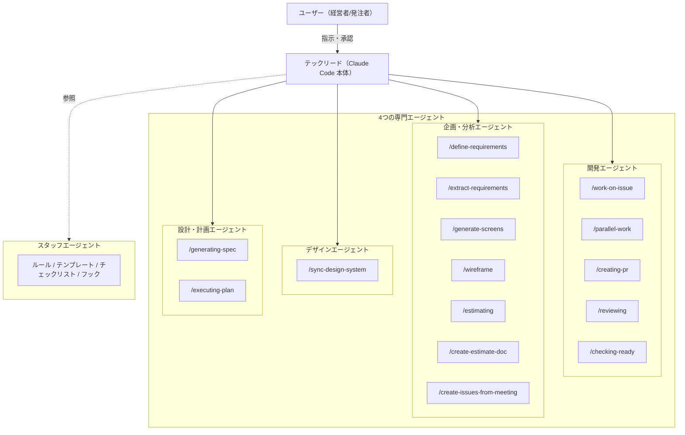

# Claude Factory

**チャットの指示のみで、議事録を元に要件定義作成・WF作成・デザイン作成・イシュー化など上流〜下流工程を完全自動化。Agent Teams と worktree の併用による並列実装で、PM・エンジニアの工数を大幅に削減する AI エージェント基盤です。**

> **注意**: これはテスト用リポジトリです。検証した内容をベースに、社内リポジトリへ展開予定です。

## 設計思想

プロジェクト知識を **Why**（`CLAUDE.md`, `knowledge/`）・**Map**（`docs/`）・**Rules**（`.claude/rules/`, `.claude/hooks/`）・**Workflows**（`.claude/commands/`）の4象限で整理し、AI が自律的に判断・行動できる構造にしています。

## アーキテクチャ

このリポジトリの AI エージェントは「会社組織」のメタファーで設計されています。

| 比喩 | 実体 |
|---|---|
| 👤 経営者/発注者 | ユーザー（あなた） |
| 🧑‍💻 テックリード | Claude Code 本体 |
| ⚙️ 開発エージェント | コーディング系コマンド（`/work-on-issue`, `/parallel-work` 等） |
| 📋 企画・分析エージェント | 要件定義・分析系コマンド（`/define-requirements`, `/extract-requirements` 等） |
| 🎨 デザインエージェント | デザイン系コマンド（Figma 連携） |
| 📚 スタッフエージェント | ルール・テンプレート・チェックリスト |
| 👷 動的チームメンバー | `/parallel-work` 実行時に Agent Teams で生成されるワーカー |

### エージェント組織図



### 外部連携と成果物

| 連携先 | 方式 | 用途 |
|--------|------|------|
| GitHub | 直接読み書き | PR・イシュー管理 |
| Google Calendar | MCP | 予定取得・ブリーフィング |
| Gmail | MCP | メール連携 |
| Figma | MCP | デザインデータ読み取り |
| Google Workspace | MCP | Docs・Sheets・Drive 連携 |

成果物は `docs/outputs/` 配下に案件ごとのフォルダで集約されます。

## フォルダ構成

| フォルダ | 内容 |
|---------|------|
| `.claude/commands/` | 自動化コマンドの定義 |
| `.claude/rules/` | エンジニアリングルール（セッション開始時に自動注入） |
| `.claude/hooks/` | 自動ガードレール |
| `knowledge/` | 判断基準・ビジネスルール・テンプレート |
| `docs/specs/` | 精査済み仕様書 |
| `docs/outputs/` | コマンド実行の成果物 |
| `docs/ideas.md` | アイデアの投入口 |

詳しいルールは [CLAUDE.md](CLAUDE.md) に書かれています。

## コマンド一覧

<!-- 新しいコマンドを追加したら、ここに必ず追記してください -->

| 分類 | コマンド | 機能 |
|------|---------|------|
| 企画・要件定義 | `/define-requirements` | 案件情報から要件定義書を自動生成 |
| | `/extract-requirements` | MTG・ヒアリング内容の構造化抽出 |
| | `/generate-screens` | 画面一覧・画面遷移図・レイアウト生成 |
| | `/create-issues-from-meeting` | 議事録からアクションアイテムを GitHub Issues に一括起票 |
| デザイン | `/wireframe` | 要件定義から FigJam にワイヤーフレーム生成 |
| | `/design-review` | Figma デザインデータのレビュー |
| 見積もり | `/estimating` | スプシの機能要件から工数自動算出・書き戻し |
| | `/create-estimate-doc` | 工数データと案件情報から見積書生成 |
| 設計・実装 | `/generating-spec` | 仕様書から技術設計・タスクリスト・リスク一覧を生成 |
| | `/executing-plan` | タスクリストの順次自律実行 |
| | `/work-on-issue` | イシュー起点で分析→実装→PR作成を一括実行 |
| | `/parallel-work` | 複数イシューの依存関係チェック・並列実装 |
| | `/creating-pr` | ブランチ作成・コミット・プッシュ・PR作成の一括実行 |
| レビュー・運用 | `/reviewing` | チェックリストに基づくレビュー・改善案提示 |
| | `/checking-ready` | 依存イシューの完了状況から着手可否を判定 |
| | `/briefing` | Google Calendar から当日の予定取得・関連情報の報告 |

## Rules と Hooks の役割分担

| 仕組み | 配置 | 特徴 |
|--------|------|------|
| **Rules** | `.claude/rules/` | プロンプト注入でモデルに伝える行動規範。柔軟な判断を促す |
| **Hooks** | `.claude/hooks/` | シェルスクリプトによる物理ガードレール。モデルが忘れても hooks は忘れない |

| Hook | トリガー | 動作 |
|------|---------|------|
| `check-secrets.sh` | `git commit` 実行時 | 機密情報がステージングされていたらブロック |
| `block-main-commit.sh` | `git commit` 実行時 | main ブランチでの直接コミットをブロック |
| `warn-pr-without-review.sh` | `gh pr create` 実行時 | セルフレビュー未実施の警告 |
| `warn-knowledge-change.sh` | `knowledge/` ファイル編集時 | 影響範囲の大きい変更への注意喚起 |
| `block-rules-change.sh` | `.claude/rules/` ファイル編集時 | AI によるルール変更をブロック |

## セットアップ

```bash
bash scripts/setup.sh
```

画面の指示に従い認証情報を入力すれば完了です。

> セットアップスクリプトの詳細 → [`scripts/setup.sh`](scripts/setup.sh)

## 外部サービスの設定

<details>
<summary>Google Workspace MCP / Anthropic API / GitHub / Figma の設定手順（クリックで展開）</summary>

### Google Workspace MCP（Gmail / Drive / Docs / Sheets / Calendar 等）

[google_workspace_mcp](https://github.com/taylorwilsdon/google_workspace_mcp) を使って Google Workspace と連携します。

> チームメンバーは `bash scripts/setup.sh` を実行すれば自動設定されます。以下は管理者向けの参考情報です。

#### 管理者向け: Google Cloud Console の設定（初回のみ）

<details>
<summary>クリックして展開（管理者向け）</summary>

**1. Google Cloud Console でプロジェクトを作成**

1. [Google Cloud Console](https://console.cloud.google.com) にアクセス
2. 新しいプロジェクトを作成（または既存のものを選択）

**2. 必要な API を有効化**

「APIとサービス」→「有効なAPIとサービス」で以下を有効化：

- Google Drive API
- Google Docs API
- Google Sheets API
- Gmail API
- Google Calendar API

**3. OAuth 同意画面を設定**

1. 「APIとサービス」→「OAuth 同意画面」を開く
2. ユーザーの種類: **内部** を選択（Google Workspace アカウント同士で使う場合）
3. スコープの設定はデフォルトのままで OK（MCP 側が必要なスコープを自動リクエストします）

**4. OAuth クライアント ID を作成**

1. 「APIとサービス」→「認証情報」→「認証情報を作成」→「OAuth クライアント ID」
2. アプリケーションの種類: **ウェブアプリケーション**
3. 名前は何でも OK（例: `Claude Code 連携`）
4. 「承認済みのリダイレクト URI」に以下を追加：
   ```
   http://localhost:8000/oauth2callback
   ```
5. 作成後に表示される **Client ID** と **Client Secret** をチームに共有

</details>

#### `.env` の設定と初回認証

`bash scripts/setup.sh` を実行すると、対話形式で `.env` の設定が完了します。

初回のみ、Claude Code で Google 連携コマンド（例: `/briefing`）を実行すると認証用 URL が表示されます。クリックして Google ログインすれば、以降は自動で連携されます。

> 「このサイトにアクセスできません」と表示されても**認証は成功しています**。Claude Code に戻って同じコマンドをもう一度実行してください。

#### よくあるトラブル

| 症状 | 原因と対処 |
|------|-----------|
| `uvx: command not found` | `uv` が未インストール。`bash scripts/setup.sh` を再実行 |
| 認証 URL が表示されない | `.env` の `GOOGLE_OAUTH_CLIENT_ID` / `SECRET` が空 or 間違い |
| 「redirect_uri_mismatch」エラー | Google Cloud Console のリダイレクト URI に `http://localhost:8000/oauth2callback` が設定されていない（管理者に連絡） |
| 「access_denied」エラー | OAuth 同意画面のユーザーの種類が「外部」になっている or テストユーザーに追加されていない（管理者に連絡） |
| 認証したのにまだエラー | 同じコマンドを **もう一度実行** してください（認証後にリトライが必要） |

### Anthropic API（GitHub Actions 用）

PR やイシューに `@claude` とコメントすると Claude が自動で対応する機能に必要です。

1. [Anthropic Console](https://console.anthropic.com/) にアクセスしてログイン
2. **Settings → API Keys → Create Key** で新しいキーを生成
3. GitHub リポジトリの **Settings → Secrets and variables → Actions → New repository secret** に登録：
   - Name: `ANTHROPIC_API_KEY`
   - Secret: 生成したキー

> これは `.env` ではなく **GitHub の Repository Secrets** に登録します（GitHub Actions から使うため）。

### GitHub

PR 作成やイシュー管理に使用します。

1. GitHub → Settings → Developer settings → Personal access tokens → Tokens (classic)
2. 「Generate new token」→ `repo` スコープにチェック → Generate
3. `.env` に設定：
   ```
   GITHUB_PERSONAL_ACCESS_TOKEN=生成したトークン
   ```

### Figma

デザインデータの読み書き（ワイヤーフレーム生成、ダイアグラム出力、デザイン読み取り等）に使用します。

1. Figma → 左上のアイコン → Settings → Security → Personal access tokens
2. 「Generate new token」でトークンを生成
3. `.env` に設定：
   ```
   FIGMA_API_KEY=生成したトークン
   ```

### アクセス制御とデフォルト出力先

Figma ファイルと Google Drive フォルダへのアクセスは **許可制（fail-closed）** です。`.env` に許可されたリソースのみアクセスできます。

#### Figma

| 変数 | 必須 | 用途 |
|------|------|------|
| `FIGMA_ALLOWED_FILE_KEYS` | 既存ファイルにアクセスする場合 | アクセスを許可する fileKey（カンマ区切り） |
| `FIGMA_DEFAULT_PLAN_KEY` | 省略可 | 新規ファイルの配置先。未設定 = Drafts に作成 |

**fileKey の取得方法:**

Figma ファイルの URL から取得できます:
```
https://www.figma.com/design/aBcDeFgHiJ/ファイル名
                              ^^^^^^^^^^
                              これが fileKey
```

```
FIGMA_ALLOWED_FILE_KEYS=aBcDeFgHiJ,kLmNoPqRsT
```

> `/wireframe` や `/generate-diagrams` で新規作成したファイルの fileKey は `.env` に自動で追加されます。既存ファイルにアクセスしたい場合のみ手動追加が必要です。

**planKey の取得方法:**

1. Claude Code で `mcp__figma__whoami` を実行し、所属チーム情報を確認
2. `/wireframe` などを一度実行し、`generate_figma_design` が返す **プラン一覧** から配置先の `planKey` を確認

```
FIGMA_DEFAULT_PLAN_KEY=取得したplanKey
```

#### Google Drive

| 変数 | 必須 | 用途 |
|------|------|------|
| `GDRIVE_DEFAULT_OUTPUT_FOLDER_ID` | 省略可 | 成果物の出力先フォルダ。未設定 = マイドライブ直下 |
| `MEET_RECORDING_FOLDER_ID` | 省略可 | MTG 録音フォルダ |

設定したフォルダは自動的にアクセスが許可されます。それ以外のフォルダにアクセスしたい場合は `.claude/security/mcp-scope.json` の `allowed_drive_folder_ids` に追加してください。

**フォルダ ID の取得方法:**

Google Drive でフォルダを開き、URL の末尾がフォルダ ID です:
```
https://drive.google.com/drive/folders/1aBcDeFgHiJkLmN
                                       ^^^^^^^^^^^^^^^
                                       これがフォルダ ID
```

```
GDRIVE_DEFAULT_OUTPUT_FOLDER_ID=1aBcDeFgHiJkLmN
```

</details>

## コマンドの使い方

Claude Code のチャット欄で `/{コマンド名}` を入力して実行します。

```
例: 見積もり作成
/estimating https://docs.google.com/spreadsheets/d/xxxxx/edit
```
