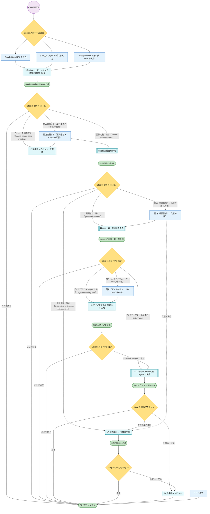
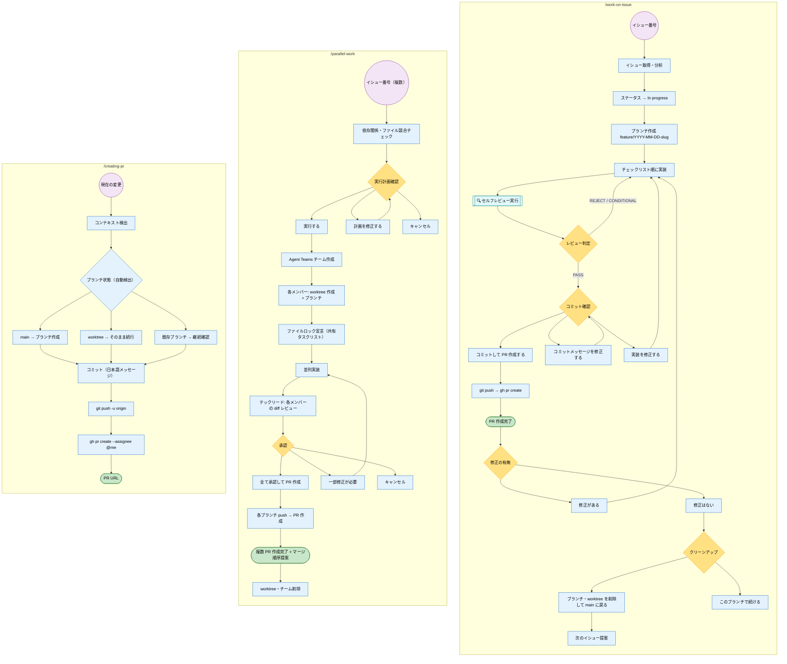
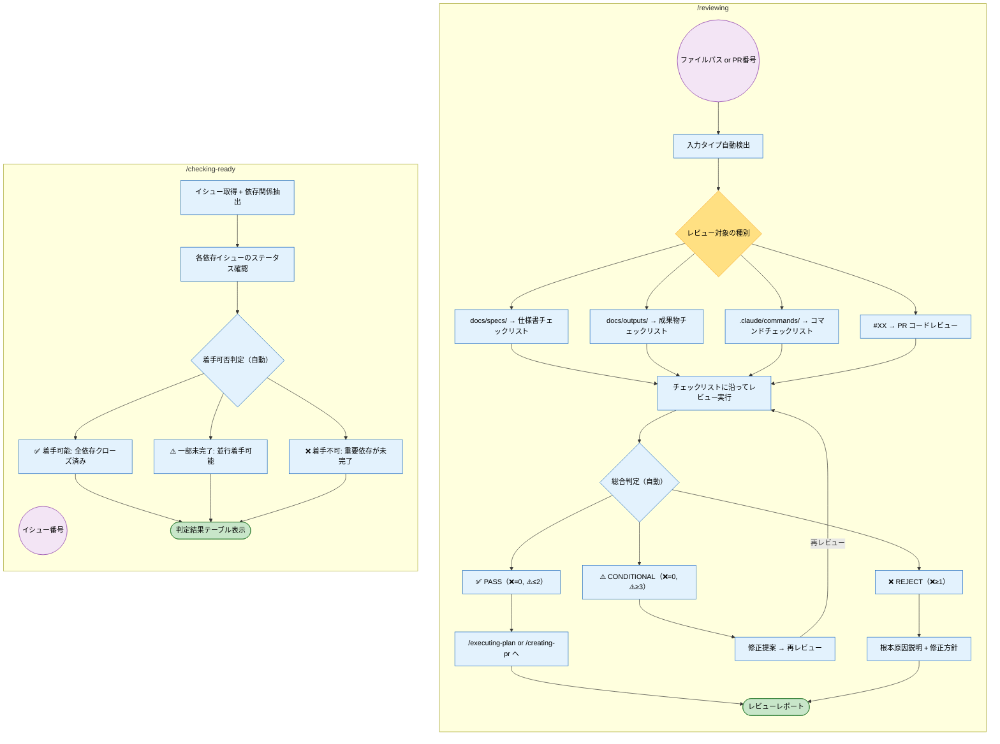

# Claude-Factory ユーザー操作フロー図

> 作成日: 2026-03-20
> 対象: 全 19 スラッシュコマンド + セッション開始フロー
> コマンド一覧・使用例: [README（.claude/commands/README.md）](../../../.claude/commands/README.md)

## 凡例

| 形状 | 意味 | 色 |
|------|------|----|
| `{ひし形}` | ユーザー選択（AskUserQuestion） | 黄 |
| `[四角]` | 自動処理ステップ | 青 |
| `([スタジアム])` | 出力成果物 | 緑 |
| `((円))` | エントリーポイント | 紫 |
| `[[二重四角]]` | コマンド呼び出し | シアン |

---

## A. システム全体俯瞰

```mermaid
graph TD
    classDef userChoice fill:#FFE082,stroke:#F9A825,color:#000
    classDef autoStep fill:#E3F2FD,stroke:#1565C0,color:#000
    classDef output fill:#C8E6C9,stroke:#2E7D32,color:#000
    classDef entryPoint fill:#F3E5F5,stroke:#7B1FA2,color:#000
    classDef command fill:#E0F7FA,stroke:#00838F,color:#000

    START(("セッション開始")):::entryPoint
    BRIEFING["/briefing 自動ブリーフィング"]:::autoStep
    PROPOSAL["今日やるべきことを提案"]:::autoStep

    START --> BRIEFING --> PROPOSAL

    CHOICE{"作業を選択"}:::userChoice
    PROPOSAL --> CHOICE

    subgraph LANE_A ["分析・設計レーン"]
        direction TB
        CMD_PIPELINE[["🔄 /run-pipeline\n対話的にパイプライン全体を実行"]]:::command
        CMD_EXTRACT[["📋 /extract-requirements\nMTG・ヒアリングから情報を構造化抽出"]]:::command
        CMD_DEFINE[["📝 /define-requirements\n案件概要から要件定義書を作成"]]:::command
        CMD_SCREENS[["🖥️ /generate-screens\n画面一覧・画面遷移図を自動生成"]]:::command
        CMD_DIAGRAMS[["📊 /generate-diagrams\n要件からダイアグラムを Figma に生成"]]:::command
        CMD_WIREFRAME[["🔲 /wireframe\nワイヤーフレームを Figma に生成"]]:::command
        CMD_DESIGN[["🎨 /design\nビジュアルデザインを Figma に生成"]]:::command
        CMD_ESTIMATING[["🔢 /estimating\n機能要件から工数を自動算出"]]:::command
        CMD_ESTIMATE_DOC[["💰 /create-estimate-doc\n工数見積から見積書を生成"]]:::command
    end

    subgraph LANE_B ["コーディングレーン"]
        direction TB
        CMD_WORK[["🔨 /work-on-issue\nイシュー起点で実装〜PR 作成"]]:::command
        CMD_PARALLEL[["⚡ /parallel-work\n複数イシューを同時並列で実装"]]:::command
        CMD_PR[["🚀 /creating-pr\n変更からブランチ作成〜PR 作成"]]:::command
    end

    subgraph LANE_C ["レビュー・品質レーン"]
        direction TB
        CMD_REVIEW[["🔍 /reviewing\n仕様書・成果物・PR をレビュー"]]:::command
        CMD_READY[["✅ /checking-ready\nイシューの着手可否を依存関係から判定"]]:::command
    end

    subgraph LANE_D ["横断機能レーン"]
        direction TB
        CMD_SPEC[["📐 /generating-spec\n仕様書から実装計画・技術設計を生成"]]:::command
        CMD_EXEC[["▶️ /executing-plan\nタスクリストを順次自律実行"]]:::command
        CMD_ISSUES[["🎫 /create-issues-from-meeting\n議事録からイシューを一括起票"]]:::command
        CMD_SYNC[["🔗 /sync-design-system\nFigma ↔ ローカルのトークンを同期"]]:::command
    end

    CHOICE --> LANE_A
    CHOICE --> LANE_B
    CHOICE --> LANE_C
    CHOICE --> LANE_D

    OUT_LOCAL(["ローカルファイル docs/outputs/"]):::output
    OUT_FIGMA(["Figma"]):::output
    OUT_SHEETS(["Google Sheets"]):::output
    OUT_GITHUB(["GitHub PR / Issues"]):::output

    LANE_A --> OUT_LOCAL
    LANE_A --> OUT_FIGMA
    LANE_A --> OUT_SHEETS
    LANE_B --> OUT_GITHUB
    LANE_C --> OUT_LOCAL
    LANE_D --> OUT_LOCAL
    LANE_D --> OUT_GITHUB
    LANE_D --> OUT_FIGMA
```

---

## B. パイプラインフロー（`/run-pipeline`）

---

## C. 個別分析コマンド詳細

```mermaid
graph TD
    classDef userChoice fill:#FFE082,stroke:#F9A825,color:#000
    classDef autoStep fill:#E3F2FD,stroke:#1565C0,color:#000
    classDef output fill:#C8E6C9,stroke:#2E7D32,color:#000
    classDef entryPoint fill:#F3E5F5,stroke:#7B1FA2,color:#000
    classDef command fill:#E0F7FA,stroke:#00838F,color:#000

    %% === /extract-requirements ===
    subgraph EXT ["/extract-requirements"]
        direction TB
        EXT_IN(("入力ソース")):::entryPoint
        EXT_TYPE{"コンテンツタイプ分類"}:::userChoice
        EXT_A["クライアント MTG（要件定義）"]:::autoStep
        EXT_B["クライアント MTG（その他）"]:::autoStep
        EXT_C["勉強会・セミナー"]:::autoStep
        EXT_D["社内検討・ブレスト"]:::autoStep

        EXT_IN --> EXT_TYPE
        EXT_TYPE --> EXT_A
        EXT_TYPE --> EXT_B
        EXT_TYPE --> EXT_C
        EXT_TYPE --> EXT_D

        EXT_OUT_A(["requirements-extracted.md"]):::output
        EXT_OUT_B(["meetings/YYYY-MM-DD-insights.md"]):::output
        EXT_OUT_C(["knowledge/YYYY-MM-DD.md"]):::output
        EXT_OUT_D(["discussions/YYYY-MM-DD.md"]):::output

        EXT_A --> EXT_OUT_A
        EXT_B --> EXT_OUT_B
        EXT_C --> EXT_OUT_C
        EXT_D --> EXT_OUT_D
    end

    %% === /define-requirements ===
    subgraph DEF ["/define-requirements"]
        direction TB
        DEF_IN(("入力ソース")):::entryPoint
        DEF_ANALYZE["要件分析・構造化"]:::autoStep
        DEF_GS{"Google Sheets 出力"}:::userChoice
        DEF_GS_A["新規スプレッドシートを作成して書き出す"]:::autoStep
        DEF_GS_B["既存スプレッドシートに書き出す（URL を入力）"]:::autoStep
        DEF_GS_C["スキップ"]:::autoStep

        DEF_IN --> DEF_ANALYZE --> DEF_GS
        DEF_GS --> DEF_GS_A
        DEF_GS --> DEF_GS_B
        DEF_GS --> DEF_GS_C

        DEF_OUT_MD(["requirements.md"]):::output
        DEF_OUT_GS(["Google Sheets"]):::output

        DEF_GS_A --> DEF_OUT_GS
        DEF_GS_B --> DEF_OUT_GS
        DEF_GS_C --> DEF_OUT_MD
        DEF_GS_A --> DEF_OUT_MD
        DEF_GS_B --> DEF_OUT_MD
    end

    %% === /generate-diagrams ===
    subgraph DIA ["/generate-diagrams"]
        direction TB
        DIA_IN(("入力ソース")):::entryPoint
        DIA_TYPE{"ダイアグラムタイプ選択"}:::userChoice
        DIA_A["画面遷移図"]:::autoStep
        DIA_B["ユーザーフロー"]:::autoStep
        DIA_C["状態遷移図"]:::autoStep
        DIA_D["シーケンス図"]:::autoStep
        DIA_E["全て生成"]:::autoStep

        DIA_IN --> DIA_TYPE
        DIA_TYPE --> DIA_A
        DIA_TYPE --> DIA_B
        DIA_TYPE --> DIA_C
        DIA_TYPE --> DIA_D
        DIA_TYPE --> DIA_E

        DIA_MERMAID["Mermaid コード生成"]:::autoStep
        DIA_HTML["HTML 生成 → ローカルサーバー起動"]:::autoStep
        DIA_FIGMA{"Figma 出力先選択"}:::userChoice
        DIA_F1["デフォルトのチーム/プロジェクトに作成"]:::autoStep
        DIA_F2["Drafts に作成"]:::autoStep
        DIA_F3["既存の Figma ファイルに追加（URL を入力）"]:::autoStep

        DIA_A --> DIA_MERMAID
        DIA_B --> DIA_MERMAID
        DIA_C --> DIA_MERMAID
        DIA_D --> DIA_MERMAID
        DIA_E --> DIA_MERMAID
        DIA_MERMAID --> DIA_HTML --> DIA_FIGMA
        DIA_FIGMA --> DIA_F1
        DIA_FIGMA --> DIA_F2
        DIA_FIGMA --> DIA_F3

        DIA_OUT(["Figma ダイアグラム + diagrams/ ローカルコピー"]):::output
        DIA_F1 --> DIA_OUT
        DIA_F2 --> DIA_OUT
        DIA_F3 --> DIA_OUT
    end

    %% === /wireframe ===
    subgraph WIRE ["/wireframe"]
        direction TB
        WIRE_IN(("入力ソース")):::entryPoint
        WIRE_GEN["HTML ワイヤーフレーム生成"]:::autoStep
        WIRE_FIGMA{"Figma 出力先選択"}:::userChoice
        WIRE_F1["デフォルトのチーム/プロジェクトに作成"]:::autoStep
        WIRE_F2["Drafts に作成"]:::autoStep
        WIRE_F3["既存の Figma ファイルに追加（URL を入力）"]:::autoStep
        WIRE_CAP{"キャプチャモード選択"}:::userChoice
        WIRE_C1["全画面を1ページにまとめてキャプチャ"]:::autoStep
        WIRE_C2["画面ごとに個別キャプチャ"]:::autoStep

        WIRE_IN --> WIRE_GEN --> WIRE_FIGMA
        WIRE_FIGMA --> WIRE_F1
        WIRE_FIGMA --> WIRE_F2
        WIRE_FIGMA --> WIRE_F3
        WIRE_F1 --> WIRE_CAP
        WIRE_F2 --> WIRE_CAP
        WIRE_F3 --> WIRE_CAP
        WIRE_CAP --> WIRE_C1
        WIRE_CAP --> WIRE_C2

        WIRE_OUT(["Figma ワイヤーフレーム"]):::output
        WIRE_C1 --> WIRE_OUT
        WIRE_C2 --> WIRE_OUT
    end

    %% === /design ===
    subgraph DSN ["/design"]
        direction TB
        DSN_IN(("入力ソース")):::entryPoint
        DSN_TOKEN["デザイントークン確認"]:::autoStep
        DSN_COLOR{"カラーパレット判定"}:::userChoice
        DSN_COL_A["カラーパレットを先に決める（トレンド調査 → 候補提示）"]:::autoStep
        DSN_COL_B["デフォルトのニュートラルカラーで仮生成する"]:::autoStep
        DSN_COL_C["カラーの方向性をテキストで指示する"]:::autoStep

        DSN_IN --> DSN_TOKEN --> DSN_COLOR
        DSN_COLOR --> DSN_COL_A
        DSN_COLOR --> DSN_COL_B
        DSN_COLOR --> DSN_COL_C

        DSN_LAYOUT{"レイアウト承認"}:::userChoice
        DSN_L1["この方針で進める"]:::autoStep
        DSN_L2["調整したい点がある"]:::autoStep

        DSN_COL_A --> DSN_LAYOUT
        DSN_COL_B --> DSN_LAYOUT
        DSN_COL_C --> DSN_LAYOUT
        DSN_LAYOUT --> DSN_L1
        DSN_LAYOUT --> DSN_L2
        DSN_L2 -->|"調整後"| DSN_LAYOUT

        DSN_FIGMA{"Figma 出力先選択"}:::userChoice
        DSN_F1["デフォルトのチーム/プロジェクトに作成"]:::autoStep
        DSN_F2["Drafts に作成"]:::autoStep
        DSN_F3["既存の Figma ファイルに追加（URL を入力）"]:::autoStep
        DSN_CAP{"キャプチャモード選択"}:::userChoice
        DSN_CAP1["全画面を1ページにまとめてキャプチャ"]:::autoStep
        DSN_CAP2["画面ごとに個別キャプチャ"]:::autoStep

        DSN_L1 --> DSN_FIGMA
        DSN_FIGMA --> DSN_F1
        DSN_FIGMA --> DSN_F2
        DSN_FIGMA --> DSN_F3
        DSN_F1 --> DSN_CAP
        DSN_F2 --> DSN_CAP
        DSN_F3 --> DSN_CAP
        DSN_CAP --> DSN_CAP1
        DSN_CAP --> DSN_CAP2

        DSN_OUT(["Figma デザイン"]):::output
        DSN_CAP1 --> DSN_OUT
        DSN_CAP2 --> DSN_OUT
    end

    %% === /generate-screens ===
    subgraph SCR ["/generate-screens"]
        direction TB
        SCR_IN(("入力ソース")):::entryPoint
        SCR_EXTRACT["機能要件から画面を抽出"]:::autoStep
        SCR_LIST["画面一覧テーブル生成"]:::autoStep
        SCR_FLOW["画面遷移図 Mermaid 生成"]:::autoStep

        SCR_IN --> SCR_EXTRACT --> SCR_LIST --> SCR_FLOW

        SCR_OUT_LIST(["screens/screens.md"]):::output
        SCR_OUT_FLOW(["screens/flow.md"]):::output
        SCR_LIST --> SCR_OUT_LIST
        SCR_FLOW --> SCR_OUT_FLOW
    end

    %% === /estimating ===
    subgraph ESTM ["/estimating"]
        direction TB
        ESTM_IN(("スプレッドシート URL")):::entryPoint
        ESTM_READ["スプレッドシート読み込み"]:::autoStep
        ESTM_ANALYZE["機能要件分析・複雑度判定"]:::autoStep
        ESTM_CALC["工数算出（基準値 × 複雑度 + 20%バッファ）"]:::autoStep
        ESTM_WRITE["スプレッドシートに書き戻し"]:::autoStep

        ESTM_IN --> ESTM_READ --> ESTM_ANALYZE --> ESTM_CALC --> ESTM_WRITE

        ESTM_OUT(["Google Sheets 更新完了"]):::output
        ESTM_WRITE --> ESTM_OUT
    end

    %% === /create-estimate-doc ===
    subgraph EST ["/create-estimate-doc"]
        direction TB
        EST_IN(("スプレッドシート URL")):::entryPoint
        EST_INFO["プロジェクト情報入力"]:::autoStep
        EST_PRICE{"単価選択"}:::userChoice
        EST_P1["¥50,000 /人日（junior）"]:::autoStep
        EST_P2["¥70,000 /人日（mid）"]:::autoStep
        EST_P3["¥100,000 /人日（senior）"]:::autoStep
        EST_P4["カスタム金額を入力"]:::autoStep

        EST_IN --> EST_INFO --> EST_PRICE
        EST_PRICE --> EST_P1
        EST_PRICE --> EST_P2
        EST_PRICE --> EST_P3
        EST_PRICE --> EST_P4

        EST_PHASE{"フェーズ分割"}:::userChoice
        EST_PH1["フェーズ分割なし"]:::autoStep
        EST_PH2["フェーズ分割あり"]:::autoStep

        EST_P1 --> EST_PHASE
        EST_P2 --> EST_PHASE
        EST_P3 --> EST_PHASE
        EST_P4 --> EST_PHASE
        EST_PHASE --> EST_PH1
        EST_PHASE --> EST_PH2

        EST_OUT(["estimate-doc.md"]):::output
        EST_PH1 --> EST_OUT
        EST_PH2 --> EST_OUT
    end
```

---

## D. コーディングレーン

---

## E. レビュー・品質レーン

---

## F. 横断機能レーン

```mermaid
graph TD
    classDef userChoice fill:#FFE082,stroke:#F9A825,color:#000
    classDef autoStep fill:#E3F2FD,stroke:#1565C0,color:#000
    classDef output fill:#C8E6C9,stroke:#2E7D32,color:#000
    classDef entryPoint fill:#F3E5F5,stroke:#7B1FA2,color:#000
    classDef command fill:#E0F7FA,stroke:#00838F,color:#000

    %% === /briefing ===
    subgraph BRF ["/briefing"]
        direction TB
        BRF_IN(("セッション開始")):::entryPoint
        BRF_S1["Step 1: オープン PR 状況確認"]:::autoStep
        BRF_S2["Step 2: レビュー依頼確認"]:::autoStep
        BRF_S3["Step 3: worktree 状態確認"]:::autoStep
        BRF_S4["Step 4: 未完了イシュー確認（⚠️ 7日以上放置）"]:::autoStep
        BRF_S5["Step 5: 直近24h のマージ確認"]:::autoStep
        BRF_S6["Step 6: 今日の行動提案"]:::autoStep

        BRF_IN --> BRF_S1 --> BRF_S2 --> BRF_S3 --> BRF_S4 --> BRF_S5 --> BRF_S6

        BRF_OUT(["ブリーフィングレポート"]):::output
        BRF_S6 --> BRF_OUT
    end

    %% === /generating-spec ===
    subgraph SPEC ["/generating-spec"]
        direction TB
        SPEC_IN(("仕様書ファイルパス")):::entryPoint
        SPEC_READ["仕様書 + knowledge/ 読み込み"]:::autoStep
        SPEC_TECH{"技術選択が必要？"}:::userChoice
        SPEC_T1["技術オプション A / B / C を提示"]:::autoStep
        SPEC_T2["既存コード・ルールから自動決定"]:::autoStep

        SPEC_IN --> SPEC_READ --> SPEC_TECH
        SPEC_TECH -->|"選択必要"| SPEC_T1
        SPEC_TECH -->|"自動決定"| SPEC_T2

        SPEC_GEN["architecture.md + tasks.md + risks.md 生成"]:::autoStep
        SPEC_T1 --> SPEC_GEN
        SPEC_T2 --> SPEC_GEN

        SPEC_OUT(["docs/outputs/slug/ に3ファイル出力"]):::output
        SPEC_GEN --> SPEC_OUT
    end

    %% === /executing-plan ===
    subgraph EXEC ["/executing-plan"]
        direction TB
        EXEC_IN(("タスクファイルパス")):::entryPoint
        EXEC_READ["未完了タスク抽出"]:::autoStep

        EXEC_LOOP["タスクを順次実行"]:::autoStep
        EXEC_IN --> EXEC_READ --> EXEC_LOOP

        EXEC_DANGER{"危険操作？"}:::userChoice
        EXEC_LOOP --> EXEC_DANGER
        EXEC_D1["実行する"]:::autoStep
        EXEC_D2["スキップ"]:::autoStep
        EXEC_DANGER -->|"外部API・データ削除等"| EXEC_D1
        EXEC_DANGER -->|"スキップ"| EXEC_D2
        EXEC_DANGER -->|"安全な操作"| EXEC_SAFE

        EXEC_SAFE["タスク実行 → チェックボックス更新"]:::autoStep
        EXEC_D1 --> EXEC_SAFE
        EXEC_D2 --> EXEC_NEXT

        EXEC_DEP{"依存未完了？"}:::userChoice
        EXEC_SAFE --> EXEC_NEXT
        EXEC_LOOP -.-> EXEC_DEP
        EXEC_DEP -->|"依存先を先に実行"| EXEC_LOOP
        EXEC_DEP -->|"このタスクをスキップ"| EXEC_NEXT

        EXEC_NEXT["次のタスクへ"]:::autoStep
        EXEC_NEXT -->|"残タスクあり"| EXEC_LOOP

        EXEC_OUT(["execution-report.md"]):::output
        EXEC_NEXT -->|"全タスク完了"| EXEC_OUT
    end

    %% === /create-issues-from-meeting ===
    subgraph ISS ["/create-issues-from-meeting"]
        direction TB
        ISS_IN(("議事録ファイルパス")):::entryPoint
        ISS_EXTRACT["アクションアイテム抽出"]:::autoStep
        ISS_PREVIEW["プレビューテーブル表示"]:::autoStep

        ISS_CONFIRM{"起票確認"}:::userChoice
        ISS_C1["全件起票する"]:::autoStep
        ISS_C2["選択して起票する"]:::autoStep
        ISS_C3["キャンセル"]:::autoStep

        ISS_IN --> ISS_EXTRACT --> ISS_PREVIEW --> ISS_CONFIRM
        ISS_CONFIRM --> ISS_C1
        ISS_CONFIRM --> ISS_C2
        ISS_CONFIRM --> ISS_C3

        ISS_SELECT{"各アイテム"}:::userChoice
        ISS_C2 --> ISS_SELECT
        ISS_S1["起票する"]:::autoStep
        ISS_S2["スキップする"]:::autoStep
        ISS_SELECT --> ISS_S1
        ISS_SELECT --> ISS_S2

        ISS_CREATE["gh issue create 実行"]:::autoStep
        ISS_C1 --> ISS_CREATE
        ISS_S1 --> ISS_CREATE

        ISS_OUT(["GitHub Issues 作成完了"]):::output
        ISS_CREATE --> ISS_OUT
        ISS_C3 --> ISS_CANCEL(["キャンセル"]):::output
    end

    %% === /sync-design-system ===
    subgraph SYNC ["/sync-design-system"]
        direction TB
        SYNC_IN(("Figma URL（任意）")):::entryPoint
        SYNC_HAS_URL{"URL あり？"}:::userChoice

        SYNC_IN --> SYNC_HAS_URL
        SYNC_HAS_URL -->|"あり"| SYNC_EXTRACT
        SYNC_HAS_URL -->|"なし"| SYNC_RULES

        SYNC_EXTRACT["Figma トークン抽出"]:::autoStep
        SYNC_DIFF["Figma ↔ ローカル差分検出"]:::autoStep
        SYNC_REPORT(["sync-report.md"]):::output
        SYNC_EXTRACT --> SYNC_DIFF --> SYNC_REPORT

        SYNC_APPROVE{"差分承認"}:::userChoice
        SYNC_REPORT --> SYNC_APPROVE
        SYNC_AP1["承認 → design-system.md 更新"]:::autoStep
        SYNC_AP2["却下"]:::autoStep
        SYNC_APPROVE --> SYNC_AP1
        SYNC_APPROVE --> SYNC_AP2

        SYNC_RULES["デザインシステムルール生成"]:::autoStep
        SYNC_AP1 --> SYNC_RULES

        SYNC_OUT(["design-system-rules.md"]):::output
        SYNC_RULES --> SYNC_OUT
    end
```

---

## コマンド網羅チェック

| # | コマンド | ダイアグラム |
|---|---------|------------|
| 1 | `/briefing` | F |
| 2 | `/run-pipeline` | B |
| 3 | `/extract-requirements` | C |
| 4 | `/define-requirements` | C |
| 5 | `/generate-screens` | B + C |
| 6 | `/generate-diagrams` | C |
| 7 | `/wireframe` | C |
| 8 | `/design` | C |
| 9 | `/estimating` | B + C |
| 10 | `/create-estimate-doc` | C |
| 11 | `/work-on-issue` | D |
| 12 | `/parallel-work` | D |
| 13 | `/creating-pr` | D |
| 14 | `/reviewing` | E |
| 15 | `/checking-ready` | E |
| 16 | `/generating-spec` | F |
| 17 | `/executing-plan` | F |
| 18 | `/create-issues-from-meeting` | F |
| 19 | `/sync-design-system` | F |
