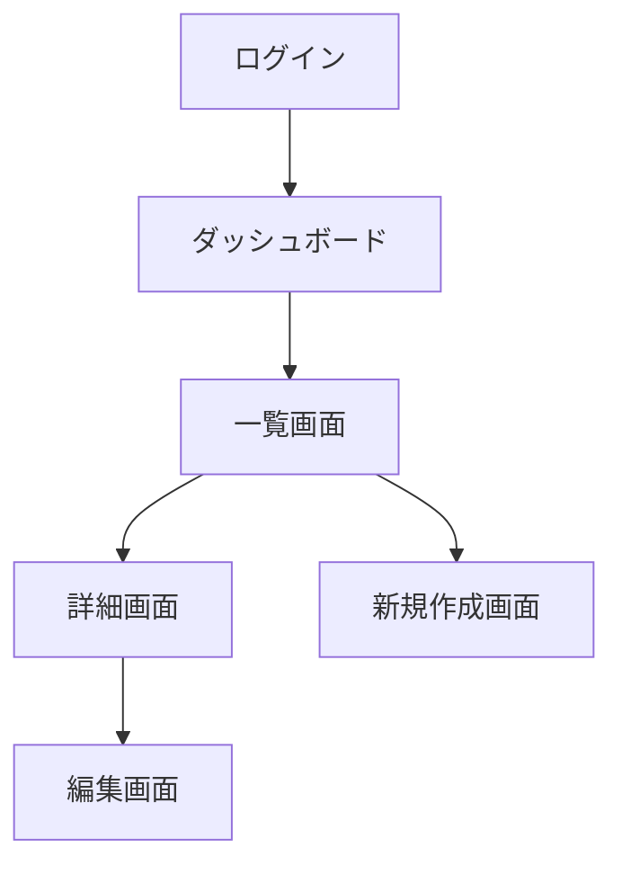

# {プロジェクト名} プロトタイプ

## 基本情報

| 項目       | 内容                             |
| ---------- | -------------------------------- |
| プロジェクト | {プロジェクト名}                 |
| 要件定義書 | {参照した要件定義書のパス/URL}   |
| 作成日     | {YYYY-MM-DD}                     |
| バージョン | {v1.0}                           |

## 画面一覧

| #  | 画面名     | 目的                 | 主要操作               | 表示データ           | 備考 |
| -- | ---------- | -------------------- | ---------------------- | -------------------- | ---- |
| 1  | {画面名}   | {この画面の目的}     | {作成/閲覧/編集/削除等} | {表示するデータ}     | ...  |

## 画面遷移図

> ⚠️ 上記は例です。実際のプロジェクトの要件に合わせて画面遷移を記述してください。

## 各画面レイアウト

### {画面名}

**画面の目的**: {この画面で何を達成するか}

**レイアウト構成**:

| エリア           | 内容                                     |
| ---------------- | ---------------------------------------- |
| ヘッダー         | {ロゴ、ナビゲーション、ユーザーメニュー等} |
| サイドバー       | {メニュー項目、フィルター等（なければ「なし」）} |
| メインコンテンツ | {主要な表示内容、フォーム、テーブル等}   |
| フッター         | {ページネーション、アクションボタン等}   |

**主要コンポーネント**:

- {コンポーネント名}: {概要}（例: 検索バー、データテーブル、フォーム）
- ...

**ユーザーアクション**:

| アクション       | トリガー         | 結果                   |
| ---------------- | ---------------- | ---------------------- |
| {アクション名}   | {ボタン/リンク等} | {画面遷移/データ更新等} |

---

> 以降、画面ごとに `### {画面名}` セクションを繰り返す
